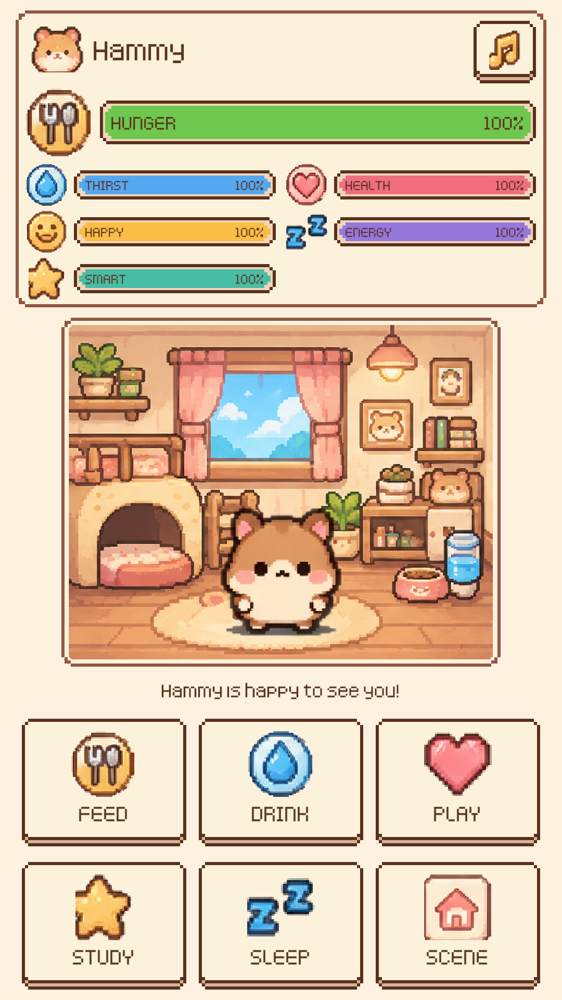
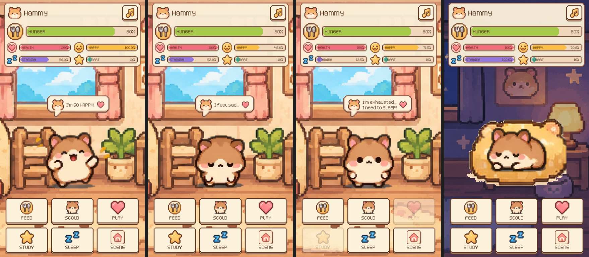

# CSEL Tamagotchi

A Tamagotchi-style virtual pet for phones (portrait 9:16), made in Unity. Look after a pixel-art
hamster by feeding it, giving it water, studying, sleeping and playing. It reacts with an animated
emote and a sound to every action. Let it go hungry and it gets **hangry**. Neglect it for too long
and it gets **sick**.

<p align="center"></p>

<p align="center"></p>

> Screenshots generated with **Tamagotchi → Capture Screenshot** / **Capture State Screenshots**
> (states left to right: eating, sleeping in the bed, hangry, playing at the beach).

## Download & play

Ready-to-run builds are on the **[Releases page](https://github.com/Tinenen-cs/Tinenen-cs-csel-tamagotchi/releases/latest)**:

| Device | File | How to run |
|--------|------|------------|
| Windows | `CSEL-Tamagotchi-Windows.zip` | Unzip, double-click `CSEL-Tamagotchi.exe`. If SmartScreen warns, click **More info → Run anyway**. |
| Android | `CSEL-Tamagotchi-Android.apk` | Download on the phone, tap it, allow **Install unknown apps**. |
| macOS | `CSEL-Tamagotchi-macOS.zip` | Unzip, **right-click** `CSEL-Tamagotchi.app` → **Open** → **Open** (first time only; the app isn't notarized). |

## Status

| Step | Feature | Status |
|------|---------|--------|
| 1 | Project setup (portrait, Canvas Scaler, safe area, art import) | ✅ Done |
| 2 | UI layout (stat bars, pet area, action buttons, Scene button, mute) | ✅ Done |
| 3 | Stats, hunger bar, hangry state, sick / game over + Restart | ✅ Done |
| 4 | Pet state machine and emotes (idle, eating, studying, sleeping, playing, happy, sad, crying, hangry, sick) | ✅ Done |
| 5 | Audio (AudioManager, CC0 sounds, music, mute) | ✅ Done |
| 6 | Save/load with offline decay | ✅ Done |
| 7 | Polish (petting, bar pops, scene crossfade, game-over pop-in, app icon) | ✅ Done |
| 8 | Builds: Windows ✅, Android APK ✅, WebGL on GitHub Pages ⏳ (needs WebGL Build Support module) | 🚧 In progress |

## Features

- **Five stats (0–100):** Hunger, Happiness, Energy, Intelligence and Health. They decay every
  second. All numbers are in `Assets/Data/PetStatsConfig.asset` (see *Tuning the stats*).
- **Hunger bar** at the top that goes green → yellow → red. **Below 25%** the pet is **hangry**: the bar
  flashes red and pulses, and the mood line says so. *(The angry emote and hangry sound come in steps 4–5.)*
- **Health** drops while Hunger is at 0, and slowly recovers while Hunger is above 50%.
- **Sick / game over:** if Health reaches 0, **or Hunger stays at 0 for 30 seconds**, the pet gets
  sick. A game-over card with the crying hamster and a **Restart** button appears.
- **Sleep** restores Energy over time (4 per second) and slows the other stats. The pet wakes up by
  itself when Energy is full, or when you tap Sleep again or do anything else.
- **Full-screen scenes:** the background fills the whole screen behind the UI. The **Scene** button
  cycles through 6 pixel-art backgrounds (default: cozy home). The stats sit at the top and the
  buttons at the bottom, leaving the middle clear so nothing covers the pet.
- **Props from the asset pack where they mean something:** the food bowl appears while eating and the pet
  sleeps in the soft bed. Scenes stay clean (no extra decoration over the painted backgrounds).
- **Speech bubble** in the asset pack's style (hamster face, text, heart) above the pet reacts to every action ("Yum yum!", "Too tired to study...").
  Messages fade after a few seconds; warnings like **"I'm HANGRY! Feed me!"** stay until fixed.
  While the pet sleeps the bubble is hidden (the sleeping animation draws its own "Zzz").
- **Animated pet with a state machine** (`PetController`). It reacts visibly to every button and to its stats:

  | State | When | Animation and effect |
  |-------|------|-------------|
  | Idle | Nothing special going on | `idle` frames, slow loop |
  | Eating | FEED (2 s) | `eating` frames + little hops, food bowl beside the pet |
  | Studying | STUDY (2 s) | `studying` frames |
  | Playing → Happy | PLAY (2 s, then 1.2 s happy) | `playing` then `happy` frames + bouncing |
  | Sad | SCOLD (2 s), Happiness below 25%, or the pet refuses (too tired) | `sad` frames |
  | Crying | Health below 25% | `crying` frames |
  | Hangry | Hunger below 25% | `sad` frames + red pulse + angry shake |
  | Sleeping | SLEEP | `sleeping` frames in the soft bed; the screen dims and switches to the moonlit bedroom |
  | Sick | Health 0 / starving too long | `crying` frames + green tint; game-over card (animated) |

  Priority when several apply: Sick > Sleeping > Hangry > Crying > Sad > Idle. Button reactions play on
  top for a moment, except while sick or asleep.
- **Audio for everything:** a click for every button, a unique sound for each button's action and for
  every emote (eat, study, sleep, play, happy, sad, cry, hangry, sick, game over), a repeating warning
  while hangry, and a looping background tune. The ♪ button mutes everything and is remembered.
- **Polish:** tap the hamster to pet it (a happy wiggle, "Hehe, that tickles!", a little Happiness; not
  while asleep or sick), stat bars pop when an action changes them, scenes crossfade (also when falling
  asleep / waking up), the game-over card pops in, and the app has a hamster-face icon.
- **Save/load:** the pet (all stats, asleep or not, the chosen scene) is saved automatically every
  5 seconds, when the app is minimised, and when it quits. Time away counts at a slower "offline"
  speed (default 5%: one hour away = 3 minutes of decay, capped at 72 hours), so the pet is hungrier
  when you come back, and it greets you with "I missed you! (2h 5m)". The mute setting is saved too.

## Controls

| Button | Effect (default numbers) |
|--------|--------|
| Feed | Hunger +25, Happiness +3 |
| Scold | Happiness −10, sad reaction ("Sniff... I'm sorry!") |
| Study | Intelligence +12, Energy −10, Happiness −5 (refused if Energy < 10: "too tired") |
| Sleep | Falls asleep and Energy refills over time; tap again to wake up |
| Play | Happiness +20, Energy −8, Hunger −3 (refused if Energy < 8) |
| Scene | Changes the background (cozy home → sunny garden → beach → forest stream → sunset rooftop → moonlit bedroom) |
| ♪ (top right) | Mute / unmute music and sounds (remembered next time; the icon fades while muted) |
| Tap the hamster | Pet it: Happiness +3, happy reaction (once per second; not while asleep or sick) |
| Restart | On the game-over card: new pet with starting stats |

## Tuning the stats

1. In Unity's **Project** window open `Assets > Data` and click **PetStatsConfig**.
2. The **Inspector** shows every number: starting values, decay per minute, sleep speed, health
   drain/regeneration, the hangry threshold, how long hunger can stay at 0, and each button's effect.
3. Change values. They apply the next time you press Play. Your edits are kept when the scene is
   regenerated.
4. **Demo mode:** set **Time Scale** to `10` (or `30`) to watch the hunger bar drain, go hangry and get
   sick in about a minute. Set it back to `1` for normal play.
5. **Offline Decay Multiplier** (default `0.05`) sets how fast stats change while the game is closed;
   **Max Offline Hours** caps long absences. Time Scale does not affect offline time.

## Screen layout

- Portrait 9:16, Canvas Scaler **Scale With Screen Size**, reference **1080×1920**, safe area respected.
- Screen Match Mode is **Expand** (not *Match 0.5*): the whole 1080×1920 layout always fits. Taller phones
  get extra room around the pet, and wide windows (desktop, browser, the Editor's *Free Aspect*) keep
  the UI in a centered 9:16 column (`PortraitFrame`) while the background fills the window. *Match 0.5*
  squashed the layout in wide windows and clipped the button row on extra-tall phones.

## Unity version and packages

- **Unity 6.3 LTS — `6000.3.24f1`**
- Render pipeline: **URP 2D** (Universal Render Pipeline)
- Packages (from `Packages/manifest.json`): Universal RP, Input System, uGUI (includes TextMeshPro),
  2D Sprite, 2D Animation, Test Framework.

## Project structure

```
Assets/
  Art/
    Pet/Hamster/      hamster animation frames (idle, eating, studying, sleeping, happy, playing, sad, crying)
    Backgrounds/      6 scenes, portrait 1080x1920 (cozy_home, moonlit_bedroom, sunny_garden, beach, forest_stream,
                      sunset_rooftop), cropped + scaled from the pack by Tools/make_backgrounds.py
    Props/            props from the pack (the food bowl and soft bed are used in game)
    UI/               Buttons/, Dialogs/, Status/ sprites from the pack
      Icons/          round stat icons cut from the Status bars (by Tools/make_ui_sprites.py)
      Generated/      9-slice bar/button/panel frames drawn in the pack's palette
    Fonts/            Kenney Pixel font (CC0) + its TextMesh Pro font asset
    Icon/app_icon.png app icon (hamster face on a cream tile, made by Tools/make_ui_sprites.py)
  Editor/
    BuildScript.cs             menu "Tamagotchi > Build": WebGL, Android APK, Windows
    ProjectSetup.cs            menu "Tamagotchi > Setup Project": player settings + generates Main.unity
    MainSceneBuilder.cs        builds the whole UI layout and wires every reference
    PhoneGameViewSize.cs       adds/selects the "Phone 1080x1920" Game view size
    ScreenshotCapture.cs       menu "Tamagotchi > Capture Screenshot" -> Docs/screenshot.png
    ArtImportPostprocessor.cs  imports Assets/Art as Point-filtered, uncompressed sprites (+ 9-slice borders)
  Scenes/Main.unity   the game scene (generated by ProjectSetup; don't edit by hand, see below)
  Scripts/
    UI/UIManager.cs   owns all UI: stat bars, buttons, mood text; raises ActionPressed / MutePressed
    UI/StatBar.cs     one 0-100 meter (fixed color or gradient)
    UI/PressBounce.cs squash-and-spring feedback on button press
    UI/PopIn.cs       fade + springy scale-in when a panel appears (game-over card)
    UI/SpeechBubble.cs  pop-in speech bubble above the pet (normal or sticky messages)
    UI/SafeArea.cs    keeps UI clear of notches and cut-outs
    UI/PortraitFrame.cs keeps the UI a centered 9:16 column in wide windows
    World/BackgroundSwitcher.cs  full-screen background: Scene button cycling + temporary override (used by Sleep)
    Pet/PetStats.cs        the five stats: decay, actions, sleep, health, hangry, sick
    Pet/PetStatsConfig.cs  ScriptableObject with all tuning numbers
    Pet/PetController.cs   state machine: Idle, Eating, Studying, Sleeping, Playing, Happy, Sad, Crying, Hangry, Sick
    Pet/SpriteAnimator.cs  flip-book animation of sprite frames on a UI Image
    Audio/AudioManager.cs  singleton: one SFX AudioSource + one music AudioSource, sounds by name, mute
    Audio/Sound.cs         one named sound (clip, volume, pitch, random variation) - from the original Sound class
    Audio/PetAudio.cs      which sound plays when (buttons, emotes, hangry repeat, game over)
    GameManager.cs         wires buttons -> stats + pet reactions, and stats -> UI (bars, hangry, game over)
    SaveSystem.cs          PlayerPrefs save/load + offline time; autosave every 5 s, on pause and on quit
  Data/PetStatsConfig.asset  the tuning values used by the game
  TextMesh Pro/       TextMesh Pro essential resources
  Tests/PlayMode/     smoke test, UI layout, stat rules, game-flow and pet state machine tests
Docs/                 screenshots
Tools/
  verify.sh           batch-mode check: compile, regenerate scene, run tests
  build.sh            command-line builds: webgl | android | windows (-> Builds/)
  publish_webgl.sh    pushes Builds/WebGL to the gh-pages branch (GitHub Pages)
  package_release.py  zips builds into Builds/Release/ and can publish a GitHub Release
  screenshots.sh      regenerates Docs/screenshot.png and Docs/states_overview.png
  make_ui_sprites.py  cleans button sprites, cuts icons, draws frames (Python + Pillow)
  make_music.py       generates the background music loop (Python standard library)
  make_backgrounds.py crops the pack's wide scenes to 9:16 and scales them to 1080x1920 (Python + Pillow)
```

## Audio credits

All files are in `Assets/Audio/`. Kenney's license: `Assets/Audio/Kenney-License.txt`.

| File | Plays when | Source (pack / original file) | License |
|------|------------|-------------------------------|---------|
| `SFX/click.ogg` | any button | [Kenney UI Audio](https://kenney.nl/assets/ui-audio) / `click3.ogg` | CC0 1.0 |
| `SFX/mute.ogg` | sound turned back on | [Kenney Interface Sounds](https://kenney.nl/assets/interface-sounds) / `toggle_001.ogg` | CC0 1.0 |
| `SFX/scene.ogg` | SCENE button | Kenney Interface Sounds / `maximize_003.ogg` | CC0 1.0 |
| `SFX/scold.ogg` | SCOLD button | Kenney Interface Sounds / `error_004.ogg` | CC0 1.0 |
| `SFX/eat.ogg` | eating emote | Kenney Interface Sounds / `drop_003.ogg` | CC0 1.0 |
| `SFX/study.ogg` | studying emote | [Kenney RPG Audio](https://kenney.nl/assets/rpg-audio) / `bookFlip2.ogg` | CC0 1.0 |
| `SFX/sleep.ogg` | sleeping emote | Kenney RPG Audio / `cloth2.ogg` | CC0 1.0 |
| `SFX/play.ogg` | playing emote | [Kenney Digital Audio](https://kenney.nl/assets/digital-audio) / `phaseJump1.ogg` | CC0 1.0 |
| `SFX/happy.ogg` | happy emote | [Kenney Music Jingles](https://kenney.nl/assets/music-jingles) / `jingles_NES12.ogg` | CC0 1.0 |
| `SFX/sad.ogg` | sad emote (scolded, refused, low happiness) | Kenney Music Jingles / `jingles_PIZZI11.ogg` | CC0 1.0 |
| `SFX/cry.ogg` | crying emote (low health) | Kenney Digital Audio / `lowDown.ogg` | CC0 1.0 |
| `SFX/hangry.ogg` | hangry (repeats every 4 s) | Kenney Interface Sounds / `error_006.ogg` | CC0 1.0 |
| `SFX/sick.ogg` | pet gets sick | Kenney Digital Audio / `zapThreeToneDown.ogg` | CC0 1.0 |
| `SFX/gameover.ogg` | game-over card | Kenney Music Jingles / `jingles_NES11.ogg` | CC0 1.0 |
| `Music/hammy_theme.wav` | background loop | Original, generated by `Tools/make_music.py` for this project | Project's own |

**Swap in your own sounds:** replace a file in `Assets/Audio/SFX/` with your own using the **same file
name** (any format Unity imports: `.ogg`, `.wav`, `.mp3`). Or select the **Audio** object in the `Main`
scene and change the clip, volume or pitch of any entry in **AudioManager → Sounds**. To keep Inspector
changes, don't run *Tamagotchi → Setup Project* afterwards (it rebuilds the scene with the defaults);
edit the list in `Assets/Editor/MainSceneBuilder.cs` (`SetSounds`) instead.

## Art and font credits

| Asset | Source | License |
|-------|--------|---------|
| Hamster sprites, backgrounds, props, UI sprites | Supplied by the project owner (tamagotchi asset pack) | Project owner's own assets |
| `Assets/Art/UI/Icons/*`, `Assets/Art/UI/Generated/*` (incl. the speech bubble made from the pack's `chat_bubble.png`) | Derived from / drawn to match the pack by `Tools/make_ui_sprites.py` | Same as above |
| `Assets/Art/Backgrounds/*` (1080x1920) | Cropped to 9:16 and scaled up (nearest-neighbour) from the pack's `Scenes/` by `Tools/make_backgrounds.py` | Same as above |
| `Assets/Art/UI/Buttons/star.png`, `music.png`, `sleep_z.png` | Re-cut from the pack's `Source/complete_generated_asset_sheet.png` (the pack's own copies are clipped) | Same as above |
| `Assets/Art/Fonts/KenneyPixel.ttf` | [Kenney Fonts](https://kenney.nl/assets/kenney-fonts) by Kenney | CC0 1.0 (`KenneyFonts-License.txt`) |
| `Assets/TextMesh Pro/*` (LiberationSans etc.) | Unity TextMesh Pro essential resources | Unity Companion License / SIL OFL (LiberationSans) |

---

## How to run

### A. Mac (Terminal)

1. Clone the repo (first time only):
   ```bash
   git clone https://github.com/Tinenen-cs/Tinenen-cs-csel-tamagotchi.git && cd Tinenen-cs-csel-tamagotchi
   ```
   **Already cloned?** Don't clone again. Close Unity, then update the folder you have:
   ```bash
   cd ~/Tinenen-cs-csel-tamagotchi     # or wherever you cloned it
   git pull
   ```
   If `git pull` stops with "Your local changes would be overwritten" (Unity touched some files on this
   Mac), throw those local changes away and pull again (this keeps nothing you made on the Mac):
   ```bash
   git restore . && git clean -fd Assets ProjectSettings && git pull
   ```
2. Install **Unity Hub** from <https://unity.com/download>. In Unity Hub, go to **Installs → Install
   Editor** and choose **6000.3.24f1**. If it isn't listed, use the
   [Unity download archive](https://unity.com/releases/editor/archive), select **Unity 6** and find
   `6000.3.24f1`. Add the **WebGL**, **Android** and/or **iOS** build support modules if you want to
   build for those platforms.
3. Open Unity Hub:
   ```bash
   open -a "Unity Hub"
   ```
   Then go to **Projects → Add → Add project from disk** and select the `Tinenen-cs-csel-tamagotchi` folder.
4. Open the project. In the Project window, double-click `Assets/Scenes/Main.unity` and press **Play**.
   Set the Game view resolution to **1080x1920 Portrait** (or any 9:16 size) so it looks like a phone.
5. Optional command-line check (compile + scene smoke test, no GUI):
   ```bash
   UNITY="/Applications/Unity/Hub/Editor/6000.3.24f1/Unity.app/Contents/MacOS/Unity" Tools/verify.sh
   ```
6. Optional command-line builds (output in `Builds/`; Unity must be closed):
   ```bash
   export UNITY="/Applications/Unity/Hub/Editor/6000.3.24f1/Unity.app/Contents/MacOS/Unity"
   Tools/build.sh webgl     # browser build   -> Builds/WebGL/
   Tools/build.sh android   # Android phone   -> Builds/Android/CSEL-Tamagotchi.apk
   ```
   The same builds are in the Editor menu **Tamagotchi → Build** (including **macOS**).
   Package them for download, and optionally publish a GitHub Release (project owner):
   ```bash
   Tools/build.sh mac                              # -> Builds/macOS/CSEL-Tamagotchi.app
   python3 Tools/package_release.py                # -> Builds/Release/*.zip, *.apk
   python3 Tools/package_release.py --publish v1.0.0
   ```

### Test-run in the Unity Editor (Windows, step by step)

1. **Get the latest code** (Git Bash or PowerShell):
   ```bash
   cd path/to/Tinenen-cs-csel-tamagotchi
   git checkout main
   git pull
   ```
2. Open **Unity Hub** from the Start menu.
3. **First time only:** go to **Projects → Add → Add project from disk**, select the project folder
   (the one that contains `Assets`, `Packages` and `ProjectSettings`) and click **Add Project**.
4. Make sure the project row shows editor version **6000.3.24f1**. If not, click the version and pick it.
5. Click the project to open it. The first open takes a few minutes while Unity builds `Library/`.
6. In the **Project** window (bottom), go to `Assets > Scenes` and double-click **Main**.
7. Click the **Game** tab. The project adds **Phone (1080x1920)** to the resolution dropdown and selects
   it automatically when the Editor opens (or use the menu **Tamagotchi → Game View: Phone 1080x1920**).
   If it's not there, add it by hand: resolution dropdown → **+** → Label `Phone`, Type *Fixed
   Resolution*, **1080 × 1920** → **OK**. Lower the **Scale** slider if it's too big.
8. Press **▶ Play** (top center).
9. Try it:
   - **FEED / PLAY / STUDY:** the bars change and the speech bubble above the hamster reacts.
   - **SCOLD:** the hamster looks sad and says sorry; Happiness goes down.
   - **SLEEP:** the hamster sleeps, the screen dims and turns to the moonlit bedroom while Energy refills;
     tap again to wake up.
   - **PLAY:** the hamster plays and bounces, then looks happy.
   - **Tap the hamster** to pet it; watch the bars pop when a button changes them.
   - **SCENE:** the background changes.
   - To see **hangry** and **sick** quickly, use demo mode (see *Tuning the stats*).
   - **Save/load:** stop and press Play again; the pet continues where it was (minus a little offline
     decay). Use **Tamagotchi → Clear Save Data** to start over.
10. Keep the **Console** tab open (Window → General → Console). It should show no red errors.
11. Press **▶** again to stop. Changes made while playing are discarded.
12. **Run the automated tests (optional):** **Window → General → Test Runner → PlayMode → Run All**.
    All tests should be green.

### B. Other devices

#### Browser (any phone or computer) - no install
Play at **<https://tinenen-cs.github.io/Tinenen-cs-csel-tamagotchi/>**. On a phone, open the link and use
**Share → Add to Home Screen** for an app-like icon. Your pet is saved in that browser.

To publish a new version (project owner, Unity closed, *WebGL Build Support* module installed):
```bash
Tools/build.sh webgl        # builds Builds/WebGL/
Tools/publish_webgl.sh      # pushes it to the gh-pages branch; the site updates in ~1 minute
```
First time only: on GitHub open **Settings → Pages**, set **Source: Deploy from a branch**, branch
**gh-pages**, folder **/ (root)**, and **Save**.

#### Android phone
1. In Unity Hub → **Installs** → ⚙ next to 6000.3.24f1 → **Add modules** → tick **Android Build Support**
   (with *OpenJDK* and *Android SDK & NDK Tools*) → **Install**.
2. Build the APK: menu **Tamagotchi → Build → Android APK**, or `Tools/build.sh android`.
   The file is `Builds/Android/CSEL-Tamagotchi.apk`.
3. Install it, either:
   - **USB:** on the phone open **Settings → About phone** and tap **Build number** 7 times (Developer
     options on), then **Settings → Developer options → USB debugging** on. Connect the cable, open
     **File → Build Profiles → Android**, pick your phone under *Run Device* and click **Build And Run**; or
   - **Copy the APK:** send `CSEL-Tamagotchi.apk` to the phone (cable, Drive, email), tap it, and allow
     **Install unknown apps** for the app you opened it with.

#### iPhone (needs a Mac with Xcode)
1. In Unity Hub add the **iOS Build Support** module to 6000.3.24f1; install **Xcode** from the Mac App Store.
2. In Unity: **File → Build Profiles → iOS → Switch Platform → Build**, choose a folder (e.g. `Builds/iOS`).
3. Open `Builds/iOS/Unity-iPhone.xcodeproj` in Xcode. Select the **Unity-iPhone** target →
   **Signing & Capabilities** → tick **Automatically manage signing** → **Team: your Apple ID**
   (Xcode → Settings → Accounts → **+** to add it). If the bundle ID is taken, change it to something unique.
4. Connect the iPhone, select it at the top of Xcode and press **▶ Run**. The first time, on the phone open
   **Settings → General → VPN & Device Management** and **Trust** your developer certificate.
   (A free Apple ID lets the app run for 7 days before it needs re-installing.)

#### Windows / Linux
- **Play in Unity:** clone the repo the same way (Git Bash, PowerShell or a terminal), add the folder in
  Unity Hub and open `Assets/Scenes/Main.unity` (see *Test-run in the Unity Editor* above).
- **Windows app:** menu **Tamagotchi → Build → Windows** or `Tools/build.sh windows`, then run
  `Builds/Windows/CSEL-Tamagotchi.exe` (portrait window, resizable).

## Troubleshooting

- **The Scene view shows a squashed/wide layout:** that's only the editing view. Select the **Game** tab
  with **Phone (1080x1920)**; to see the phone layout in the Scene view, double-click **Canvas** in the
  Hierarchy. If it still looks wrong after `git pull`, run **Tamagotchi → Setup Project** to rebuild the scene.
- **The pet doesn't start fresh when I press Play:** the game continues your saved pet (that's the
  save system). For a brand-new pet use **Tamagotchi → Clear Save Data**, or press **RESTART** after it gets sick.

- **The UI looks squashed or the buttons overlap the room (Scene/Game view):** the Game view is on
  *Free Aspect* (a wide shape). Pick **Phone (1080×1920)** in the Game view's resolution dropdown (see
  *Test-run in the Unity Editor*). Since the portrait-frame fix, wide windows (desktop, browser) also
  keep the UI as a centered phone-shaped column with the room filling the rest of the window.
- **"Phone" is missing from the Game view's resolution list:** run **Tamagotchi → Game View: Phone 1080x1920**,
  or add it by hand (resolution dropdown → **+** → 1080 × 1920).
- **Yellow warning "Could not pick GraphicsDeviceType, the game would fail to launch":** it comes from
  Unity's **Device Simulator** after picking a phone model there. It doesn't affect the game. Switch the
  Game view's left dropdown back from *Simulator* to **Game**, or ignore it.

- **"Missing scene" or empty Hierarchy:** open `Assets/Scenes/Main.unity`, or run
  **Tamagotchi → Setup Project** from the menu bar to regenerate it.
- **I changed the layout in the Scene view and it got overwritten:** `Main.unity` is generated by
  `Assets/Editor/MainSceneBuilder.cs`. Make layout changes there, then run **Tamagotchi → Setup Project**.
- **TextMesh Pro asks to "Import TMP Essentials":** they are already in `Assets/TextMesh Pro`. Close the
  window; if text is missing, re-run **Tamagotchi → Setup Project**.
- **Sprites look blurry:** right-click `Assets/Art` and choose **Reimport**. The import postprocessor
  then re-applies Point filtering.
- **Unity asks to upgrade or downgrade the project:** use exactly `6000.3.24f1` (see
  `ProjectSettings/ProjectVersion.txt`).
- **Tools/verify.sh can't find Unity:** set the `UNITY` environment variable to your editor's path.
- **Weird errors after switching branches:** close Unity, delete the `Library/` folder and reopen.
  Unity rebuilds it.

## Contributing

```bash
git pull origin main                    # get the latest
git checkout -b feature/short-name      # new branch per change
# ...make changes in Unity, then:
Tools/verify.sh                          # make sure it compiles and the scene runs clean
Tools/screenshots.sh                     # refresh the README screenshots (Unity closed)
git add -A && git commit -m "Describe the change"
git push -u origin feature/short-name
gh pr create --base main --fill          # or open the PR on github.com
```

Always commit the `.meta` files that Unity creates next to each asset. Never commit `Library/`,
`Temp/`, `Logs/` or `UserSettings/` (the `.gitignore` already excludes them).
